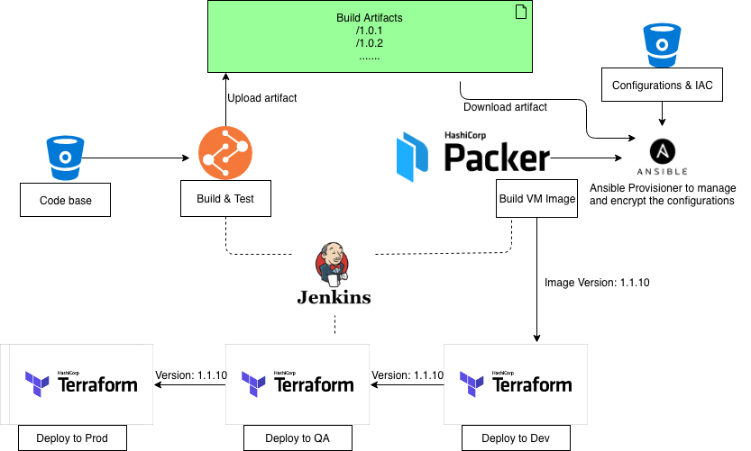

# 使用 Packer、Ansible 和 Terraform 构建不可变的基础设施

在容器编排领域，Kubernetes 已成为事实上的标准，而容器镜像 (Docker Image) 作为容器技术栈中最关键的创新之一，极大的推动了企业内部 Devops 运动的进程。

容器镜像所具有的轻量性、便携性、分层机制和内核共享机制真正意义上实现了 "Build once, run anywhere"。这种不可变的基础设施 (Immutable Infrastruture) 高度保持了开发、测试和生产环境的一致性。因为镜像的易移植、易复制的特性，也给运维带来了很大的弹性和灵活性。

对于还无法容器化，只能部署在虚拟机里的传统应用，是否也能构建像容器镜像这样不可变的的基础设施？

### 可变的服务器部署 vs. 不可变的服务器部署

#### 可变的服务器部署

在可变的服务器部署模式中，首先我们通过 [Terraform](https://www.terraform.io/) 创建出所需的虚拟机以及其它基础设施资源，然后通过配置管理工具 [Ansible](https://www.ansible.com/) 对已经存在的服务器资源进行应用相关的配置和部署。

上述的部署过程看似非常快速、简便，但是随着业务的需求增加，需要对服务器操作系统进行更新，或对部署的应用进行频繁的升级。这种情况下，可变的服务器部署模式所带来的挑战和风险是我们无法预估的。

在真实的用户场景里，运行的应用程序与操作系统、或第三方软件资源存在各种各样复杂的依赖。当给操作系统打补丁，亦或升级应用程序所依赖的软件包时，可能会出现应用程序无法正常启动、DNS 解析异常、网络不可达、性能下降等现象，这些异常可能是无法预测的，甚至是我们无法控制的。

即使应用程序更新成功，一旦线上环境产生不可预知的严重 Bug ，需要将应用程序回滚时，由于可变的服务器部署的不确定性，回滚的过程对于运维人员仍然是一项挑战。

当线上环境负载过高时，在可变的服务器部署模式下，响应也会显得不够高效。按照上述流程，需要创建新的虚拟机资源，再运行配置管理工具去部署该版本的应用。整个过程比较耗时，也较容易出错。

#### 不可变的服务器部署

相对于可变的服务器部署模式，不可变的服务器部署模式要求服务器在部署完成之后，后续每次做部署变更时，不再对现存的服务器做任何更新或升级。

不可变的服务器部署模式下，我们将会基于基础的虚拟机镜像，创建新的虚拟机，为该虚拟机安装所需软件包，部署应用程序所需要的新的代码和配置。最后将该虚拟机打包成一个新的虚拟机应用镜像。

每次部署应用时，基于以上过程创建出来的应用镜像，创建新的服务器，在这个过程中，我们不会去改动当前环境中运行的基础设施资源。

同时在整个过程中，出现任何错误，我们将直接退出。待问题解决之后，基于以上过程重新打包镜像。如果一切顺利，待虚拟机启动成功，再将线上环境流量切换到该新虚拟机上，随后销毁掉的虚拟机。这样就完成了一次部署变更。

如果线上流量较高，需要横向扩展虚拟机数量时，只需将上述已经打包好的应用镜像部署成新的虚拟机，作为额外资源加入到线上集群即可。整个响应过程十分迅速且可靠。

### 基础设施即代码 (IAC)

基于 Packer、Ansible 和 Terraform 等开源工具，构建不可变服务器部署模式的持续集成和持续部署的 Jenkins Pipeline：



#### 应用代码打包

为了使部署更加灵活，基础设施及配置代码将独立于应用本身代码，单独进行存放。

基于该代码仓库，创建自服务的 [Jenkins Multibranch](https://jenkins.io/doc/book/pipeline/multibranch/), 基于分支的变动自动触发 Build，并将软件包上传至中央制品仓库。

#### 虚拟机镜像打包 Packer

[Packer](https://www.packer.io/) 是一个优秀的开源镜像打包工具。Packer 的 builder 支持主流的公有云、私有云平台以及常见的虚拟化类型。同时它支持的 provisioner 能覆盖主流的配置管理工具: Ansible, Puppet, Chef, Windows Shell, Linux Shell 等。

在不可变的服务器的应用场景中，通过 Packer 自动创建虚拟机，然后调用 Ansible provisioner 从中央制品仓库拉取软件包、部署所需额外依赖包以及相关配置，最后自动打包成虚拟机镜像并回收该虚拟机资源，上传至云平台中。 

#### 配置管理及安全加密 Ansible

[Ansible](https://www.ansible.com/) 是一款简单的，易上手的开源配置管理工具。它能简化软件的安装部署，作为配置管理能提供灵活的模版渲染引擎以及[针对敏感信息的加密](https://docs.ansible.com/ansible/latest/user_guide/vault.html#)。

#### 基础设施的创建和编排 Terraform

[Terraform](https://www.terraform.io/) 作为开源的基础设施资源编排工具，能覆盖主流的云平台，非常适用于多云的环境。能提供灵活的部署选择，并能根据用户需求开发可插拔式的、自定义的 provider。

### 镜像部署过程中所面临的挑战

业务场景的不同，会带来部署方式的多样化要求，比如滚动部署、蓝绿部署等。

针对不可变的服务器部署模式，下面将介绍两种较典型的应用类型：

* 负载均衡器 (LB) + 应用服务器 (Web Server)
* 有状态的后端应用

***Note***: 主流的云厂商提供了类似动态虚拟机组的功能，来满足以上两种需求。本文主要介绍使用 Terraform 构建通用的解决方案。

#### 负载均衡器配置的平滑更新

在 LB + Web Server 这种业务场景下，为了尽量减少服务不可用的时间，制定了蓝绿部署的解决方案。

在资源池中，会存在蓝和绿两种虚拟机组。每次版本更新时，会选择**非**线上版本的一组虚拟机组做更新。

当**非**线上的版本更新完毕之后，会获取新创建的虚拟机 (VM) 的 IP 列表，将其动态更新至 LB 的后端。

在对 LB 进行更新时，定义该资源的 [lifecycle](https://www.terraform.io/docs/configuration/resources.html#lifecycle-lifecycle-customizations) 为 `create_before_destroy = true`。 这样每次更新时会先把新的后端虚拟机 IP 添加至 LB，待所有新虚拟机组的后端 IP 加入完毕之后，terraform 再去移除旧的虚拟机 IP 组.

```
resource "xx_cloud_load_balance" "lb" {
  # ...

  lifecycle {
    create_before_destroy = true
  }

}
```

#### 有状态应用的平滑升级

同样为了有状态的应用更平滑的更新，在旧版本虚拟机销毁之前，需要发送一些个性化的指令，让应用程序能够优雅地退出。

除了对该虚拟机组资源的 lifecycle 指定 `create_before_destroy = true`, 还指定了一个 `local-exec` 的 provisioner 去优雅的停掉旧虚拟机组里的应用。

***Note***: 在本例子中，脚本 `drain_nodes.sh` 相对复杂，因为会并行创建多台虚拟机，所以需要加入类似锁的机制来避免竞争的情况发生。

```
resource "xx_cloud_vm_instance" "instances" {
  count = "${var.instance_count}"

  # ...
  lifecycle {
    create_before_destroy = true
  }

  provisioner "local-exec" {
    command = "bash ${path.module}/scripts/drain_nodes.sh ${var.old_instance_list}
  }

}
```

***Note***: 由于 [terraform issue](https://github.com/hashicorp/terraform/issues/13549), 当指定了 `create_before_destroy = true` 时, 不能再使用 [Destroy-Time Provisioners](https://www.terraform.io/docs/provisioners/index.html#destroy-time-provisioners)。

#### 部署的可靠性和稳定性

为了提高部署的可靠性，在销毁旧的虚拟机组或者更新 LB 配置之前，需要确保新创建的虚拟机是健康可用的。为此从两个角度去优化：

* 为了尽早发现潜在的问题，在使用 Packer 打包镜像的时候，加入简单的健康检查机制，确保应用代码和配置是匹配的。
* 在新的虚拟机启动之后，加入自我健康检查的脚本：

```
resource "xx_cloud_vm_instance" "instances" {

  # ...

  provisioner "local-exec" {
    command = "bash ${path.module}/scripts/health_check.sh ${self.ipv4_address}
  }

}
```

#### 镜像构建一次，多处部署

不同的环境 (Dev, QA, Prod), 会对应不同的配置文件。云环境中，支持给虚拟机传入 `user_metadata` 去区分不同的环境，由于镜像中包含所有环境的配置文件，可以通过传入的 `user_metadata` 去选择相应的配置文件启动应用程序。

```
resource "xx_cloud_vm_instance" "instances" {

  # ...
  user_metadata = "dev"

}
```

#### 快速伸缩和回滚

从运维角度来看，可伸缩、可回滚性是平台维护中不可或缺的特性。

在 Terraform 中，我们可以通过简单的指定 `count` 数量来伸缩虚拟机数量：

```
resource "xx_cloud_vm_instance" "instances" {

  count = "${var.instance_count}
  # ...

}
```

由于镜像包含应用程序所需要的所有配置和代码，虚拟机镜像的版本也就代表了应用程序的版本。回滚应用程序相当于指定虚拟机镜像的版本重新部署：

```
resource "xx_cloud_vm_instance" "instances" {

  # ...
  image_version = "${var.image_version}"

}
```

#### 镜像的打包效率

相对于可变服务器部署模式，由于打包虚拟机镜像过程较为耗时，在一定程度上会加长整个部署的时间。

因为镜像里包含了应用程序所需要的代码和配置，每一次配置更新或者代码更新需要重新打包镜像时，可以考虑把配置和代码从镜像中分离出来提高打包效率：

* 将镜像分层管理，分为基础操作系统镜像和应用镜像。基础操作系统镜像中包含软件运行所需要的基本环境以及相关依赖（Python, C#、 第三方工具或者相关依赖包等)。这样在构建应用镜像时只安装与应用相关的代码和配置，不必再重新安装基础镜像中存在的基础软件包、配置，缩短了应用镜像的打包时间。
* 将配置迁移至配置管理服务，应用程序启动时从该配置服务中动态获取配置信息，避免每次因为配置文件更新需要重新打包镜像。
* 将配置和代码迁移至网络文件存储（NFS），虚拟机每次启动时挂载该网络文件存储去读取配置和代码。每次代码或者配置文件更新只需更新挂载的文件系统中的内容。可以极大的降低镜像打包频率。

### 总结

相对于 [AWS auto scaling group](https://docs.aws.amazon.com/autoscaling/ec2/userguide/AutoScalingGroup.html)、[Google Autoscaling groups](https://cloud.google.com/compute/docs/autoscaler/) 和 [Azure VMSS](https://docs.microsoft.com/en-us/azure/virtual-machine-scale-sets/overview) 等公有云平台提供的原生服务，以上解决方案还未能集成云平台中的监控系统做到资源的自动伸缩。但在多云的环境，或云平台提供的虚拟机组功能欠缺时，这种基于 Terraform 本身构造的通用解决方案仍有用武之地。在实际场景中用户可以灵活选择。

相对于传统的应用部署方式，不可变服务器部署模式延长了从代码提交到收到部署反馈的时间，在初期也会让开发者有一定的学习成本，在一定程度上牺牲了开发体验。但不可否认，它所带来的环境的一致性、运维的弹性，仍然是 Devops 运动中首推的解决方案。
